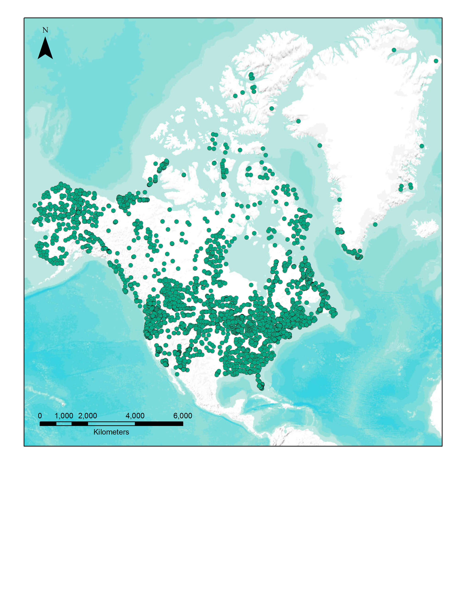

# Modern pollen data for North America

Modern pollen data for North America from the Whitmore et al. 2005 pollen database. The database is described in *Modern pollen data from North America and Greenland for multi-scale paleoenvironmental applications* (*Quaternary Science Reviews* **24**: 1828-1848), and is openly available via the [University of Ottawa Laboratory for Paleoclimatology and Climatology](http://www.lpc.uottawa.ca). A mirror is found on the [Williams Lab website](https://williamspaleolab.github.io). 

## Description of files:

* Metadata:
  * A detailed description of the individual .csv files. 

* Update History:
  * A chronological list of updates that have been made to the database.

* Pollen Data:
  * The modern pollen data from 4,833 sites across North America (and a few from Greenland). Information is available for latitude, longitude, species counts, environmental setting, etc.
  
* Climate and Bioclimate:
  * Information about temperature, growing degree days, evapotranspiration, precipitation and insolation.

* AVHRR:
  * Information about natural and potential vegetation derived from cartographic sources and earth observation satellite sensors.

* Positional Errors:
  * Some identified location errors.

* Removed Pollen Sites:
  * Some sites that should not be included in the database.

* East West:
  * Range and site overlap information.
  
  ## Distribution of sites

